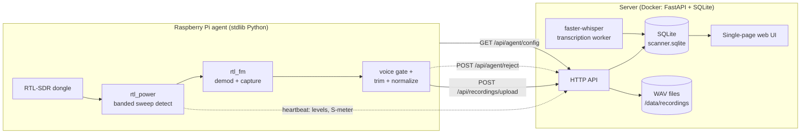
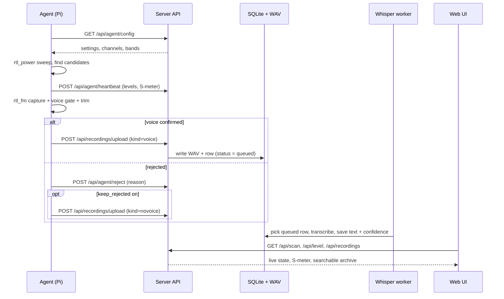
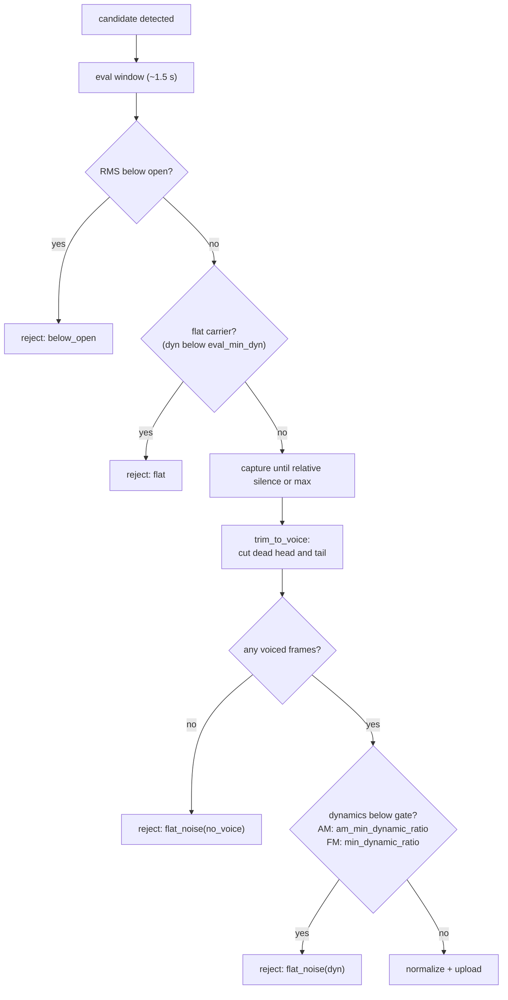
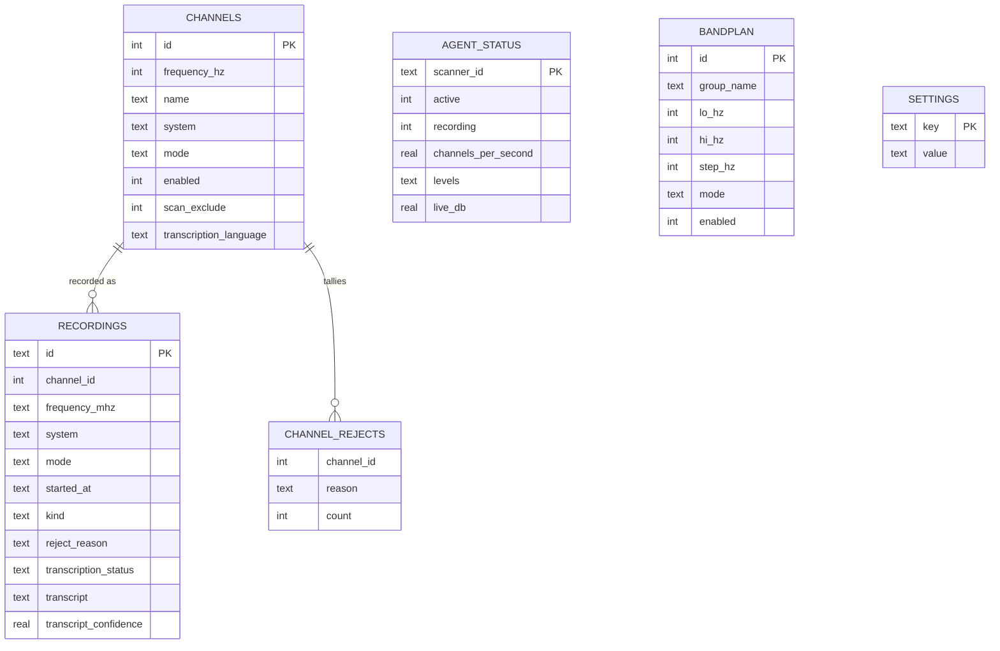

# RTL SIGINT Scanner

Open-source SDR scanner. A lightweight Raspberry Pi **agent** drives an RTL-SDR to
sweep banks of channels, detect activity and record transmissions. A Dockerized
**server** (FastAPI + SQLite) stores the recordings, serves a rich single-page
scanner dashboard, edits channels and band plans, and runs automatic speech
transcription with faster-whisper.

It is inspired by hardware scanners (Uniden-style banks, lockout, priority) but
adds a searchable web archive, an analog S-meter, per-channel signal levels, a
Monitor mode that auto-plays new transmissions, and a no-voice review pane to
understand why a channel was skipped.

## Contents

- [Architecture](#architecture)
- [Features](#features)
- [Data flow](#data-flow)
- [Detection and the voice gate](#detection-and-the-voice-gate)
- [Data model](#data-model)
- [Web UI](#web-ui)
- [Quick start: server](#quick-start-server)
- [Quick start: agent](#quick-start-agent-raspberry-pi)
- [Configuration](#configuration)
- [HTTP API](#http-api)
- [Band plan](#band-plan)
- [Repository layout](#repository-layout)
- [Hardware notes](#hardware-notes)
- [Legal and license](#legal-and-license)

## Architecture

Two processes connected only over HTTP. The agent runs next to the dongle (on a
Raspberry Pi); the server runs anywhere Docker runs. They never share a filesystem.



### Agent (Raspberry Pi)

Standard-library Python only, so it runs on a Pi 3 without extra packages. It:

1. pulls settings, the enabled channel list and the band plan from
   `GET /api/agent/config`;
2. groups nearby channels into banks and detects activity with wide `rtl_power`
   sweeps (few processes, high channels-per-second);
3. records each active candidate with a single `rtl_fm` spawn through a clean
   demod chain;
4. filters noise and dead carriers with the voice gate, trims dead air, normalizes;
5. uploads the WAV to `POST /api/recordings/upload`;
6. reports scan rate, current frequency, a live audio level for the S-meter and
   per-channel signal levels via `POST /api/agent/heartbeat`;
7. reports skipped candidates and their reason via `POST /api/agent/reject`, and
   optionally uploads the rejected audio for review;
8. self-heals the dongle with `USBDEVFS_RESET` when it wedges.

Two scan engines are selectable: `search` (spawns `rtl_power` per band, light, good
on a Pi 3) and `channelizer` (in-process retuning, faster, intended for a Pi 4).

### Server (Docker)

FastAPI app with a thin SQLite layer, static single-page UI, and a background
transcription worker.

- Routers: `status` (status, settings, live scan, S-meter level), `channels`
  (channel and bank editor, bulk ops, category rename), `recordings` (archive,
  audio stream, upload, delete, disk usage, bulk purge, re-transcribe), `agent`
  (config pull, heartbeat, reject and carrier-exclude reporting), `bandplan`
  (band toggles).
- `services/transcription.py`: a worker thread that transcribes queued recordings
  with faster-whisper and stores a text plus a confidence score. Language is chosen
  per bank (English for aviation, Italian otherwise) and overridable per channel.
- Storage: one SQLite file (`scanner.sqlite`) plus WAV files, both under `/data`.

## Features

- Single-page dashboard: banks, memories, recordings archive and live activity in
  one view, no page reloads.
- Analog S-meter driven by a fast `/api/level` poll, tracking the live signal.
- Live activity list: every scanned channel with its dB-above-floor bar, the
  detection threshold marker, a valid-recording count and a no-voice reject count.
- Monitor mode: auto-plays each new transmission as it arrives (near-live scanner).
- No-voice review: optionally keeps rejected clips (rolling, last N per channel) so
  you can listen and learn why a channel fails (carrier, noise, or voice cut).
- Recordings feed with a per-clip live spectrogram on play, full-text search,
  filters by bank, mode and time, and a group-by-frequency view.
- Transcription with a reliability score, and a permissive re-transcribe that
  disables VAD and previous-text conditioning to recover cut transcripts.
- Disk usage indicator and one-click bulk purge (no-voice, older-than, or all).
- Channel and bank editor with per-row enable, bulk enable/disable and rename.
- Band plan: enable whole frequency ranges by group with one click.

## Data flow

A single transmission, end to end:



## Detection and the voice gate

Detection and recording are separate.

- **Detection** is cheap and wide. `rtl_power` sweeps a whole bank and reports a
  power per bin. The noise floor is taken as a low percentile of the bins (not the
  median, which in a busy band sits on top of the carriers and hides signals). Any
  bin that rises above the floor by `detection_margin_db` becomes a candidate.
- **Recording** is per candidate. `rtl_fm` demodulates one frequency through a
  narrow NBFM (or AM for aviation) chain with de-emphasis and a low-leakage FIR.

The gate keeps real voice and drops hiss and steady carriers, in stages:



Notes:

- AM aviation voice is far less dynamic than FM (a weak ATC over is close to its
  carrier), so AM uses a lower final gate (`am_min_dynamic_ratio`, default 1.4)
  than FM (`min_dynamic_ratio`, default 2.6).
- `close_rel` ends a recording over a constant carrier: a steady carrier never
  drops below an absolute threshold, but it sits well below the voice peak, so a
  gap relative to that peak closes the recording.
- Every reject is tallied per channel and reason and shown in Live activity (the
  reject count). Turn on `keep_rejected` to listen to the rejected clips and decide
  whether the gate is too strict for a given bank, then tune the thresholds in
  Settings.

## Data model

SQLite, created and migrated on first start. Main tables:



Notes:

- `channels` is the curated memory list, grouped by `system` (the bank) and
  `group_name`. `scan_exclude` keeps a channel in the UI but out of the scan set.
- `recordings.kind` is `voice` for kept transmissions and `novoice` for rejected
  clips kept for review (rolling, last `keep_rejected_max` per channel).
- `channel_rejects` tallies why candidates failed the gate, feeding the Live
  activity reject counts.
- `settings` is a key/value store; the agent reads it through `/api/agent/config`.

## Web UI

One page (`/`), three columns:

- Left: **Banks** (toggle a whole bank into or out of the scan) and **Memories**
  (search, filter, per-row enable, bulk enable/disable, rename, delete).
- Center: **Recordings** feed with search and filters, per-clip player with a live
  spectrogram, transcript and confidence, re-transcribe and delete, plus a
  group-by-frequency view.
- Right: the analog **S-meter** and the **Live activity** list (per-channel level
  bar, threshold marker, valid and no-voice counts, sort options).

A gear opens the **Settings** modal: every tunable is a slider or toggle with an
inline explanation, plus a storage panel with disk usage and bulk-purge actions.

## Quick start: server

```bash
cp config/channels.example.csv config/channels.csv   # your channel list
docker compose up -d --build
# open http://<server-ip>:8096
```

The CSV is loaded into the database on first start; later edits in the UI are
preserved. The whisper model (about 1.5 GB for `medium`) is downloaded on the first
transcription and cached under `data/models`.

## Quick start: agent (Raspberry Pi)

```bash
sudo apt install rtl-sdr                              # provides rtl_fm and rtl_power
mkdir -p ~/scanner-agent/app ~/scanner-agent/data
cp agent/scanner_agent.py ~/scanner-agent/app/
# create a systemd unit that runs scanner_agent.py with SERVER_URL and SCANNER_DEVICE set
sudo systemctl daemon-reload
sudo systemctl enable --now scanner-agent
journalctl -u scanner-agent -f
```

Set `SERVER_URL` to the server address and `SCANNER_DEVICE` to the dongle serial
(from `rtl_test -t`), then enable a bank in the UI and press RUN.

## Configuration

Server, set in `docker-compose.yaml`:

| Variable             | Default               | Purpose                              |
| -------------------- | --------------------- | ------------------------------------ |
| `RECEIVER_NAME`      | `RTL SIGINT SCANNER`  | name shown in the UI                 |
| `WHISPER_MODEL`      | `medium`              | faster-whisper model size            |
| `WHISPER_COMPUTE`    | `int8`                | compute type (CPU friendly)          |
| `WHISPER_ENABLED`    | `1`                   | set to `0` to disable transcription  |
| `WHISPER_MODEL_DIR`  | `/data/models`        | model cache location                 |

Agent, set as environment in the systemd unit:

| Variable             | Default                 | Purpose                          |
| -------------------- | ----------------------- | -------------------------------- |
| `SERVER_URL`         | `http://localhost:8096` | server base URL                  |
| `SCANNER_DEVICE`     | `0`                     | RTL-SDR serial (`0` = first)     |
| `CONFIG_POLL_SECONDS`| `10`                    | how often to re-pull config      |

Scanner behavior lives in the `settings` table, edited in the UI (gear icon) or via
`POST /api/settings`, and served to the agent through `/api/agent/config`. See the
[voice gate](#detection-and-the-voice-gate) for the tuning knobs; if you are losing
real transmissions, lower the dynamic-ratio gates or turn on `keep_rejected` to see
why clips are rejected.

## HTTP API

Full reference in [`docs/api.md`](docs/api.md). Highlights:

- `GET /api/status`, `GET /api/scan`, `GET /api/level` (S-meter)
- `GET/POST /api/settings`
- `GET/POST/PUT/DELETE /api/channels`, `POST /api/channels/bulk`, `POST /api/categories/rename`
- `GET /api/recordings`, `GET /api/recordings/usage`, `POST /api/recordings/purge`,
  `POST /api/recordings/upload`, `POST /api/recordings/{id}/retranscribe`
- `GET /api/bandplan`, `POST /api/bandplan/{id}`, `POST /api/bandplan/group/toggle`
- `GET /api/agent/config`, `POST /api/agent/heartbeat`, `POST /api/agent/reject`,
  `POST /api/agent/exclude`

## Band plan

A band is a frequency range the agent can scan whole, so you can cover an entire
allocation without entering thousands of discrete memories. The Italian utility
plan ships in `config/bandplan_it.csv` and is seeded into the database on first
start. Toggle bands or whole groups in the editor or via the API.

## Repository layout

```text
server/   FastAPI app: main, db, models, config, routers/, services/, static/, templates/
agent/    Raspberry Pi scanner agent
config/   channel CSV and band plan (example committed; real lists git-ignored)
docs/     architecture, API reference and operations notes
docker-compose.yaml
```

Runtime data (the database, recordings, whisper models) and personal channel lists
stay out of git, see [`.gitignore`](.gitignore).

## Hardware notes

Built for a Raspberry Pi and an RTL-SDR (for example a Nooelec NESDR SMArt). A
single USB 2.0 bus is shared, so two dongles contend; the agent targets one serial
and self-recovers the dongle when it wedges. Antenna and siting dominate real-world
quality far more than software.

## Legal and license

MIT, see [LICENSE](LICENSE). This tool scans radio allocations and records audio.
Receiving, recording and decoding radio traffic is regulated and the rules differ
by country. You are responsible for using it within the law where you operate.
