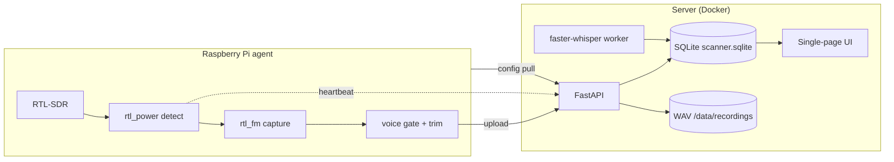
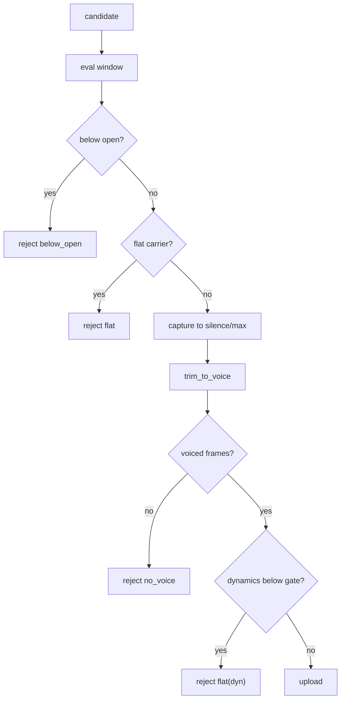

# Architecture

RTL SIGINT Scanner is two processes connected only over HTTP: a Raspberry Pi
**agent** that owns the RTL-SDR, and a Dockerized **server** that stores data and
serves the UI. They do not share a filesystem.

## Agent

Standard-library Python (Pi 3 friendly). Loop:

1. Pull `settings`, enabled `channels` and `bands` from `GET /api/agent/config`.
2. Group nearby channels into banks; detect activity with wide `rtl_power` sweeps.
   The noise floor is a low percentile of the FFT bins; a bin above the floor by
   `detection_margin_db` is a candidate.
3. Capture each candidate with one `rtl_fm` spawn (narrow NBFM, or AM for aviation,
   de-emphasis, low-leakage FIR).
4. Run the voice gate (see below), trim dead air, normalize.
5. Upload kept transmissions; report rejects and per-channel signal levels.
6. Self-heal the dongle with `USBDEVFS_RESET` when it stops delivering samples.

Engines: `search` (one `rtl_power` per band, light) and `channelizer` (in-process
retuning, faster, intended for a Pi 4).

## Server

FastAPI plus a thin SQLite layer and a background transcription thread.

| Router        | Responsibility                                                       |
| ------------- | -------------------------------------------------------------------- |
| `status`      | status snapshot, settings get/set, live scan view, S-meter level     |
| `channels`    | channel and bank CRUD, bulk enable/disable, category and group rename |
| `recordings`  | archive list, audio stream, upload, delete, disk usage, purge, re-tx  |
| `agent`       | config pull, heartbeat, reject and carrier-exclude reporting          |
| `bandplan`    | list and toggle band-plan ranges                                      |

`services/transcription.py` is a daemon thread: it claims `queued` recordings,
transcribes them with faster-whisper, and stores the text, the per-segment JSON and
a confidence score. Language is English for aviation banks and Italian otherwise,
overridable per channel.

## The voice gate

The final dynamics gate differs by mode: AM aviation uses `am_min_dynamic_ratio`
(default 1.4, because ATC voice is close to its carrier) and FM uses
`min_dynamic_ratio` (default 2.6). `trim_to_voice` already requires voiced frames,
so on FM the final gate is the main place real but low-dynamic voice can be lost;
lower it if you are missing transmissions. See [operations.md](operations.md).

## Data model

See the entity diagram and notes in the [README](../README.md#data-model). Tables:
`channels`, `recordings`, `channel_rejects`, `agent_status`, `settings`, `bandplan`.
The database is created and migrated automatically on first start.
